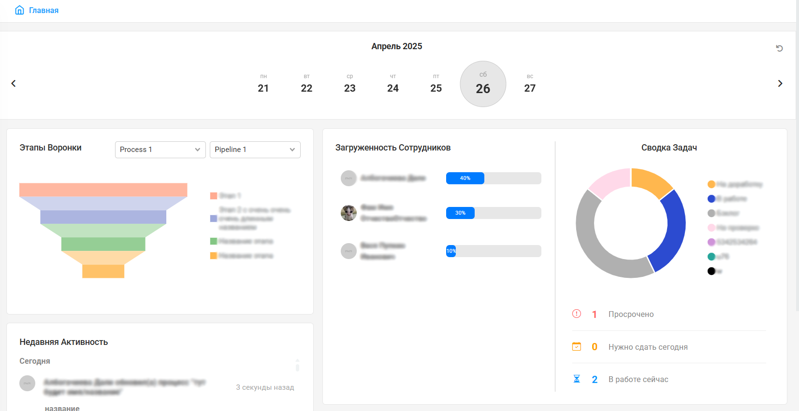
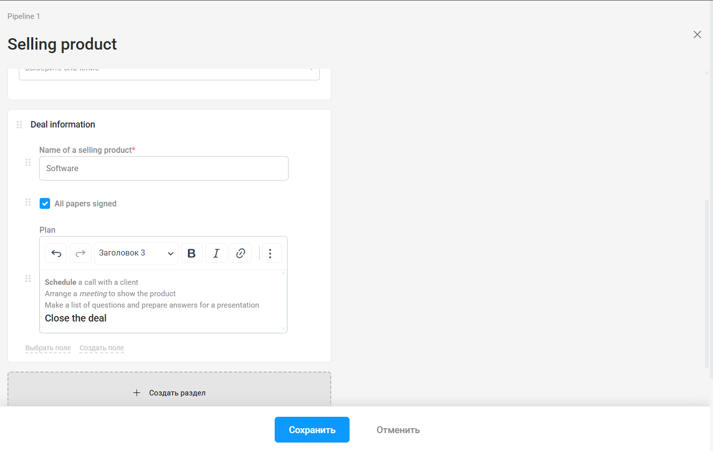

# CRM Snippets

🎯 **Фронтенд-модули для корпоративной CRM-системы / Frontend modules for a corporate CRM system**

Здесь собраны модули и элементы, которые были созданы мной для стартап-проекта CRM-системы. Разработка находилась на этапе MVP, код готовился к тестированию внутри компании и в компаниях заказчиков. Рабочий процесс вёлся по методологии Agile в команде frontend и backend разработчиков.
Функционал урезан и отредактирован, чтобы показать отдельные модули без связки с сервером.

This repository contains modules and UI elements developed by me for a CRM startup project. The development was in the MVP stage, and the code was prepared for internal testing within the company and by client companies. The work process followed the Agile methodology in a team of frontend and backend developers.
The functionality has been trimmed and adapted to showcase modules without server integration.

---

## 🔧 Стек / Stack

- Vue 3 + Vite + Pinia
- JavaScript / TypeScript
- Bootstrap 5
- ApexCharts.js
- Swiper.js

---

## 📦 Структура / Structure

### 📊 Dashboard (разработала прототип, дизайн и сами модули / I developed the prototype, design, and the modules)

- `DashboardTasksOverview.vue` — визуализация данных об актуальный задачах /  visualization of active tasks (ApexCharts)
- `DashboardCalendar.vue` — интерактивный слайдер-календарь / interactive calendar slider (Swiper.js)

### 🏢 Подразделения организации / Organization Departments

Интерфейс, отображающий все подразделения организации и редактируемую информацию о них (редактирование и создание подразделений вырезано для демо-версии)
Interface for displaying all organizational departments and managing their information (The editing/creation functionality was removed for demo purposes)

- `DepartmentTreeLayout.vue` — древовидное представление / tree layout
- `DepartmentTabsLayout.vue` — представление вкладками / tabs layout

---

## 🖼 Скриншоты интерфейса, созданного мной / Screenshots of app interfaces developed by me

### Функциональный Дашборд / Functional Dashboard

Отображает аналитику по всей организации в соответствие с выбранной датой календаря. Пользователь может сразу увидеть актуальные задачи, недавние изменения в организации и текующие рабочие процессы.

Covers analytics across all organization according to selected date. User can see relevant tasks, recent changes inside organization and current work processes.

### Компонент Кастомных Полей Ввода / Custom Input Fields Component

Пользователи могут создавать поля разных типов (текст, дата, число, ссылка, файл и т.д.) внутри отдельных разделов, чтобы хранить информацию, которая выходит за рамки стандартного функционала приложения.

Users can create fields of different types (text, date, number, link, file etc.) inside separate sections to store data that goes beyond default app features.

---

## 🚀 Demo

Интерактивную демо-версию можно посмотреть на GitHub Pages.

Interactive demo is available on GitHub Pages.

[Перейти к демо](https://dali-tsyb.github.io/crm-snippets/)

---

## 📫 Feel free to contact me!

> Author: [Албогачиева Дали](https://www.linkedin.com/in/dali-albogachieva)  
> GitHub: [github.com/Dali-Tsyb](https://github.com/Dali-Tsyb)  
> Telegram: [@dddalia](https://t.me/dddalia)
